<div align="center">

# Engram

**Your AI tools forget everything every night. Engram fixes that.**

[](LICENSE)
[](https://python.org)
[](https://apple.com/macos)
[](#requirements)
[](https://claude.ai/code)

*Self-distillation for knowledge workers. Runs automatically every night. Nothing to click.*

[Quick Start](#quick-start) · [How It Works](#how-it-works) · [Example Output](examples/sample-output/) · [Privacy](#privacy) · [中文文档](README.zh-CN.md)

</div>

<p align="center">
  <a href="https://lessthanno.github.io/engram-agent/">
    
  </a>
</p>

---

## The Problem

```
You:    Help me finish the Q2 report
Claude: Sure! What's the report about? What format do you want?
        What have you done so far? Who's the audience?
```

## With Engram

```
You:    Help me finish the Q2 report
Claude: You started this last Thursday. Revenue section is done.
        The churn analysis is incomplete — you noted the data source
        was unreliable. Want me to pull from the updated dashboard?
```

You didn't tell Claude any of that. Engram inferred it from your behavior.

---

## Quick Start

```bash
curl -fsSL https://raw.githubusercontent.com/lessthanno/engram-agent/main/scripts/quickstart.sh | bash
```

<details>
<summary>Or manually</summary>

```bash
git clone https://github.com/lessthanno/engram-agent.git ~/engram-agent
cd ~/engram-agent
bash scripts/install.sh
```
</details>

3 questions, 2 minutes, then never touch it again. Verify: `bash ~/engram-agent/scripts/verify.sh`

---

## How It Works

```
You work normally → Engram watches silently (7 sources)
     → Every night at 23:45, Claude distills a briefing
     → Next morning, your AI tools read it automatically
```

**What it collects** (all local, secrets auto-scrubbed):

| Source | What |
|--------|------|
| AI sessions | Claude / Cursor / Codex conversations |
| Git | Commits, diffs, velocity |
| Shell | Commands ran |
| Browser | Research tabs |
| Apps | Time per app |
| Files | Documents touched |
| System | Processes, projects |

**What it produces:**

Daily logs · Open tasks · Behavioral patterns · Weak spots · Weekly reports

All plain Markdown in a local git repo. [See example output →](examples/sample-output/)

---

## How It's Different

Most "AI memory" tools remember what you **said**. Engram observes what you **did**. Different data layer.

| | Engram | mem0 / MemGPT | CLAUDE.md |
|---|---|---|---|
| Captures behavior | Yes | No | No |
| Fully automatic | Yes | No | No |
| Finds patterns | Yes | No | No |
| 100% local | Yes | Varies | Yes |
| Zero maintenance | Yes | No | No |

They're complementary. Many people use all three.

---

## Privacy

- **100% local.** No cloud. No accounts. No telemetry.
- **Secrets scrubbed.** API keys and tokens auto-removed.
- **You own everything.** Plain files. Delete anytime.

---

## `@engram` Agent

Query your memory from any Claude Code session:

```
@engram What was I working on last Tuesday?
@engram Have I seen this problem before?
@engram What are my open tasks?
@engram What patterns am I showing this week?
```

Installed automatically. Read-only — never modifies your memory.

---

## Extend with Skills

Drop a folder into `~/.mind/skills/` to add custom collectors, synthesizers, or bridges.

```
~/.mind/skills/my-collector/
  SKILL.md      # metadata
  skill.py      # your code
```

Auto-discovered at runtime. Fault-tolerant. [Full docs →](docs/SKILLS.md)

---

## Requirements

- **macOS** (Linux/Windows coming)
- **Python 3.10+** (pre-installed on Mac)
- **Claude CLI** (optional — works without it)

Zero pip dependencies. Zero npm. Zero Docker.

---

## Uninstall

```bash
bash scripts/uninstall.sh
```

Your memory repo is preserved.

---

## FAQ

<details>
<summary><strong>How is it different from mem0?</strong></summary>
mem0 remembers what you told the AI. Engram captures what you did. Different data layer. Use both.
</details>

<details>
<summary><strong>Does it send data to the cloud?</strong></summary>
No. Everything local. No accounts, no servers, no telemetry.
</details>

<details>
<summary><strong>Does it work without Claude?</strong></summary>
Yes. Collects data without it. Claude adds AI synthesis.
</details>

<details>
<summary><strong>What if I'm not a programmer?</strong></summary>
Browser tabs, app usage, recent files, and AI sessions capture your work regardless.
</details>

---

## Contributing

Plain Python, no frameworks, no build step. Help wanted:
**Linux/Windows** · **More AI tools** · **Local dashboard** · **Team mode**

---

<p align="center">
  <sub>MIT License · Built by <a href="https://github.com/lessthanno">@lessthanno</a><br>Your AI should learn from you — not start from scratch every time.</sub>
</p>
