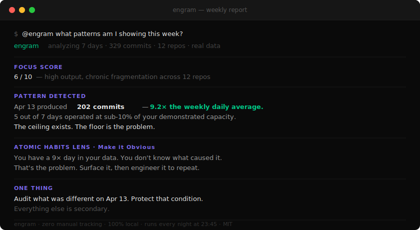

<div align="center">

# Engram

### You don't know your own patterns. Your behavior does.

[](LICENSE)
[](https://python.org)
[](https://apple.com/macos)
[](#requirements)
[](https://claude.ai/code)

</div>

<p align="center">
  
</p>

---

## The Story

I read Atomic Habits three times. Each time, same result: two weeks of tracking, then back to old patterns.

The problem isn't discipline. The problem is that **manual tracking is itself a habit** — and building a "habit of tracking habits" while building other habits stacks two hard things. The failure mode is architecturally designed in.

So I built the thing that was supposed to be too hard to automate.

**Engram watches your work behavior automatically. You do nothing. It tells you who you actually are.**

Not who you think you are. Who your data says you are.

---

## What Engram Found This Week

*This is real output from a real week. Not a demo. Not made up.*

```
Focus Score: 6/10

329 commits across 12 repos this week.
High output — but chronic fragmentation.
You never fully left any codebase.

─── Pattern Detected ──────────────────────────────────────
Apr 13 produced 202 commits — 9.2x the weekly daily average.
The prior 4 days averaged 8 commits/day.
Something unlocked on Apr 12 that carried into Apr 13.
When you hit that mode, throughput multiplied by 9x.
───────────────────────────────────────────────────────────

Time Reality:
  Planned deep work:    ~6h
  Actual deep work:     2 days (Apr 12–13)
  Days at <10% capacity: 5 out of 7

Atomic Habits Lens (Make it Obvious):
  You have a 9x day in your data.
  You don't know what caused it. That's the problem.
  Action: 2-line pre-work log this week. After 5 days,
  correlate entries against commit counts. Find the trigger.

Open Loops: 8–10 threads started, not finished.

One Thing:
  Figure out what was different on Apr 13.
  Protect that condition. Everything else is secondary.
```

This is what happens when you stop trying to remember your patterns and start letting data show them to you.

---

## The Core Value

**Engram solves two problems simultaneously:**

### Problem 1: Your AI tools forget everything every night

```
# Without Engram
You:    Help me finish the auth refactor
Claude: Sure! What's the context? What have you done so far?
        What files are involved? What approach are you taking?
```

```
# With Engram
You:    Help me finish the auth refactor
Claude: You've been working on this since Tuesday. jwt.go and
        middleware/session.go are the main files. You hit a
        snag with token revocation — noted it as unresolved
        in yesterday's session. Want to start there?
```

You didn't tell Claude any of that. Engram wrote it to `~/.claude/` last night.

### Problem 2: You can't see your own behavioral patterns

Every habit tracker requires logging. Engram doesn't. It observes what you do and surfaces patterns you'd never find manually:

- The day that was 9x more productive than average (and why)
- The context switches that silently kill your output
- The tasks you start and consistently abandon
- The time windows where your work is actually high quality

---

## Real Scenarios

**Scenario 1: The morning handoff**

You start a new Claude Code session on a complex feature. Instead of re-explaining everything, Claude already knows: what you built yesterday, what's still broken, what decision you made and why. Engram wrote a briefing at 23:45. Your AI picked it up at session start.

**Scenario 2: The pattern you didn't know existed**

After 30 days, Engram tells you: on days when you switch between 3+ projects, your commit output drops 60%. You thought you were good at parallel work. You weren't. You just believed you were. Now you block Tuesdays differently.

**Scenario 3: The unfinished task that became a problem**

A bug report comes in. You type `@engram Have I seen this before?` in Claude Code. Engram finds it: you hit this exact issue on March 15, traced it to deploy.yaml:47, left a note saying "check if this gets reverted." It did. Six weeks later. Now you know in 30 seconds instead of two hours.

**Scenario 4: The weekly review that writes itself**

Every Sunday you get a plain Markdown report. Focus score, patterns detected, open threads, Atomic Habits lens on your data. No logging required. Just a mirror of the week you actually lived.

---

## How It Works

```
You work normally
       ↓
Engram watches 7 data sources silently
       ↓
Every night at 23:45:
  ├── Collect: git, shell, apps, AI sessions, browser
  ├── Synthesize: Claude generates structured analysis
  ├── Store: plain Markdown in ~/your-memory-repo/
  └── Bridge: key insights → ~/.claude/projects/memory/
       ↓
Next session: Claude Code reads the briefing automatically
Every Sunday: weekly behavioral report in your reports folder
```

**Data sources:**

| Source | What Engram collects |
|--------|---------------------|
| Git | Commits, repos, velocity, files changed |
| AI sessions | Claude / Cursor / Codex decisions and topics |
| Shell | Commands, tools used, patterns |
| Apps | Time per app (ActivityWatch or macOS native) |
| Browser | Research tabs, topics explored |
| System | Recent files, processes, projects active |

**What it produces:**

| File | What's inside |
|------|--------------|
| `consciousness.md` | Insights, mental model shifts, non-obvious patterns |
| `patterns.md` | Behavioral and work patterns, updated nightly |
| `weaknesses.md` | Recurring problems, anti-patterns |
| `tasks.md` | Open tasks extracted from sessions |
| `reports/week-*.md` | Weekly Atomic Habits-framed behavioral report |

---

## The Atomic Habits Connection

James Clear's 4 laws — Engram automates all of them:

| Law | The manual version | What Engram does |
|-----|--------------------|-----------------|
| **Make it Obvious** | Habit tracking sheet | Surfaces your real patterns automatically |
| **Make it Attractive** | Reward systems | Weekly report that's actually interesting to read |
| **Make it Easy** | Minimum viable habit | Zero logging. Zero friction. Runs while you sleep. |
| **Make it Satisfying** | Habit streaks | 30/60/90 day behavioral history, compounding clarity |

You can't change what you can't see.

Engram's thesis: the reason most people fail to implement Atomic Habits isn't lack of discipline — it's that observation requires effort, and effort requires a habit, and habits are what you're trying to build. It's turtles all the way down.

Remove the observation cost. Watch what happens.

---

## Quick Start

```bash
curl -fsSL https://raw.githubusercontent.com/lessthanno/engram-agent/main/scripts/quickstart.sh | bash
```

3 questions. 2 minutes. Never touch it again.

<details>
<summary>Manual install</summary>

```bash
git clone https://github.com/lessthanno/engram-agent.git ~/engram-agent
cd ~/engram-agent
bash scripts/install.sh
```
</details>

Verify: `bash ~/engram-agent/scripts/verify.sh`

---

## `@engram` Agent

Query your behavioral memory from any Claude Code session:

```
@engram What was I working on last Tuesday?
@engram Have I seen this bug before?
@engram What patterns am I showing this week?
@engram What are my open tasks?
@engram When am I most productive?
```

Installed automatically. Read-only. Never modifies your memory.

---

## How It's Different

| | Engram | mem0 / MemGPT | CLAUDE.md | Habit trackers |
|---|---|---|---|---|
| Observes behavior | Yes | No | No | No |
| Zero manual input | Yes | No | No | No |
| Works if you forget | Yes | No | Yes | No |
| Finds unknown patterns | Yes | No | No | No |
| Bridges to AI tools | Yes | Yes | Yes | No |
| 100% local | Yes | Varies | Yes | Varies |

They're complementary. Engram is the behavioral data layer the others are missing.

---

## Privacy

- **100% local.** No cloud sync. No external APIs required.
- **Secrets scrubbed.** Regex patterns remove keys and tokens before synthesis.
- **You own everything.** Plain text files. No lock-in. Delete anytime.
- **Open source.** Read every line. Trust nothing you can't verify.

---

## Roadmap

### Now (v1 — shipped)
- [x] 7-source behavioral collector
- [x] Claude synthesis with fallback chain (CLI → proxy → API → offline)
- [x] Daily logs + 4 persistent analysis files
- [x] Weekly behavioral report (Atomic Habits framing)
- [x] `@engram` Claude Code agent
- [x] SessionStart / PreCompact / Stop hooks
- [x] Interactive installer + verify script
- [x] Skill extension system

### Next (v2 — in progress)
- [ ] macOS menu bar app — visual weekly report, no terminal needed
- [ ] iOS companion — view reports on mobile
- [ ] Focus score trend graph (30/60/90 days)
- [ ] Calendar integration — scheduled vs actual deep work
- [ ] Cursor and Codex deeper integration
- [ ] Linux support

### Future (v3)
- [ ] Team mode — aggregate patterns across a small team (opt-in, local)
- [ ] Behavioral diff — "how did this week compare to your best week?"
- [ ] Custom habit definitions — "tell me if I'm doing X consistently"
- [ ] Export to Obsidian / Notion / Bear

---

## The Vision

Most productivity tools tell you what to do.

Engram tells you what you already do — and lets you decide what to change.

The difference: advice from a book is about someone else. Data from your own 30 days of behavior is about you. Generic patterns don't change people. Personal patterns do.

The long-term vision: a behavioral intelligence layer for knowledge workers that compounds over time. The longer you run it, the more it knows. After a year, it can tell you things about your work patterns that you couldn't figure out in a lifetime of journaling.

This is the external memory your future self will be grateful for.

---

## Requirements

- **macOS** (Linux/Windows roadmap Q3 2026)
- **Python 3.10+** (pre-installed on Mac)
- **Claude CLI** (optional — adds AI synthesis; works offline without it)
- **ActivityWatch** (optional — adds app/keyboard tracking)

Zero pip dependencies. Zero npm. Zero Docker.

---

## Contributing

Plain Python, no frameworks, no build step.

Priority areas:
- **Linux/Windows** port
- **More AI tool collectors** (Windsurf, Zed, GitHub Copilot)
- **Local dashboard** (HTML report viewer)
- **Calendar integration**

Read [CONTRIBUTING.md](CONTRIBUTING.md) before opening a PR.

---

## Uninstall

```bash
bash scripts/uninstall.sh
```

Removes hooks and LaunchAgent. Your memory repo is preserved.

---

<div align="center">
  <sub>
    MIT License · Built by <a href="https://github.com/lessthanno">@lessthanno</a><br><br>
    <em>Atomic Habits tells you to track your behavior.<br>
    Engram does it for you.</em>
  </sub>
</div>
